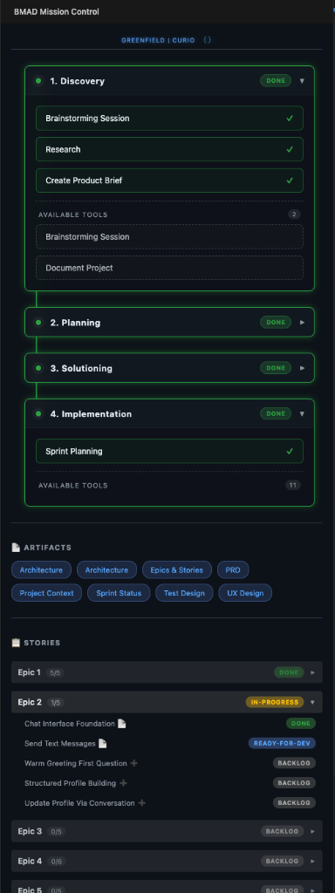

# BMAD Mission Control

**Visual sidebar for BMAD workflow management — execute workflows with one click.**


<p align="center">
  
</p>

---

## ✨ Features

### 🎯 Dynamic Phase Tracking
- **Real-time status** from `bmm-workflow-status.yaml`
- **Phase cards** with completion badges (Done, In Progress, Pending)
- **Collapsible sections** for focused navigation
- **Visual flow rail** connecting phases

### 📋 Story Integration
- **Epic/Story hierarchy** parsed from `sprint-status.yaml`
- **Progress indicators** (e.g., `5/11` done)
- **Clickable stories** — opens the `.md` file directly
- **Backlog actions** — click to copy create-story command

### 📂 Artifact Links
Auto-detects and links to common BMAD artifacts:
- PRD, Architecture, UX Design
- Epics & Stories, Sprint Status
- Project Context, Research, Test Design

### 🔄 Multi-Project Support
- **Project selector** dropdown when multiple projects detected
- **Instant switching** between workflow status files

### ⚡ One-Click Workflow Execution
- Click any workflow button → command copied to clipboard
- Chat panel opens automatically — just paste and run

---

## 🚀 Installation

### From VSIX (Local)
1. Download the `.vsix` file
2. In VS Code: `Cmd+Shift+P` → "Extensions: Install from VSIX..."
3. Select the downloaded file
4. Reload VS Code

### From Source
```bash
cd mission-control
npm install
npm run compile
# Press F5 to launch Extension Development Host
```

---

## 📖 Usage

1. **Open a BMAD project** with `_bmad-output/bmm-workflow-status.yaml`
2. **Click the BMAD icon** in the Activity Bar (left sidebar)
3. **View your workflow progress** — phases, workflows, artifacts
4. **Click any workflow button** to trigger it in Gemini/Copilot chat

---

## 🛠 Configuration

The extension reads from:
- `_bmad-output/bmm-workflow-status.yaml` — main status file
- `_bmad-output/sprint-status.yaml` — story tracking
- `_bmad/bmm/config.yaml` — project configuration

No manual configuration required — everything is auto-detected.

---

## 📁 Project Structure

```
mission-control/
├── src/
│   ├── extension.ts           # Entry point
│   ├── BmadSidebarProvider.ts # Webview UI
│   ├── WorkflowStateManager.ts # YAML parsing & state
│   └── types.ts               # TypeScript interfaces
├── resources/
│   └── bmad-icon.svg          # Activity bar icon
├── out/                       # Compiled JS (generated)
└── package.json               # Extension manifest
```

---

## 🤝 Contributing

1. Fork the repository
2. Create a feature branch
3. Make changes and test with `F5`
4. Submit a pull request

---

## 📜 License

MIT © 2026

---

## 🙏 Acknowledgments

Built for the [BMAD Method](https://github.com/bmad-method) ecosystem.
